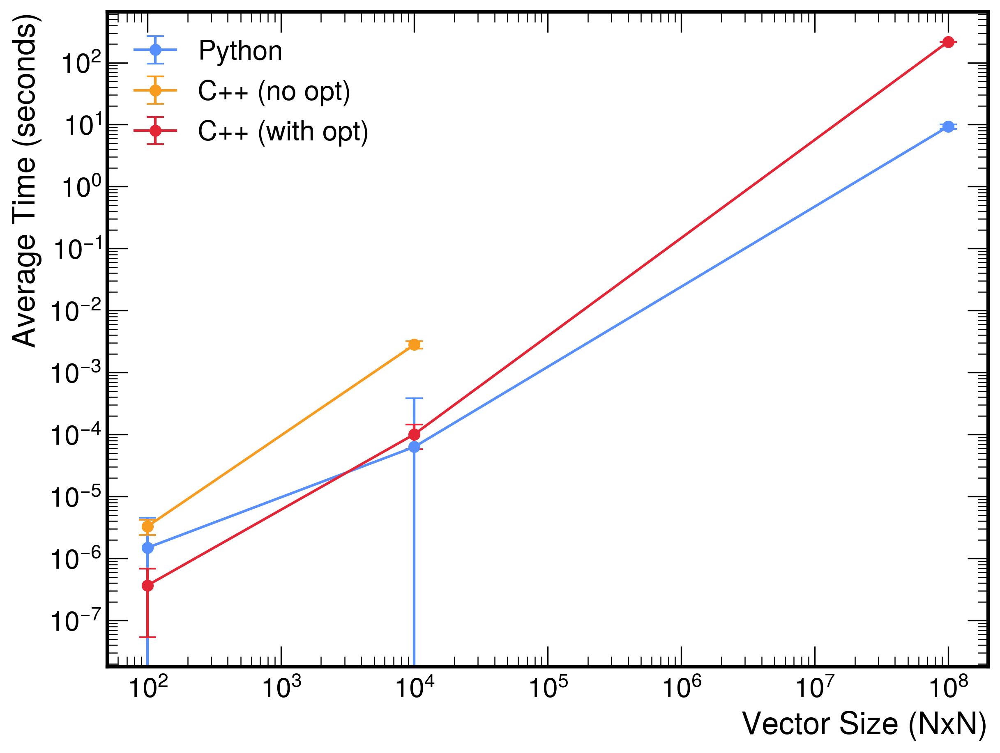

# Matrix Multiplication

This page demonstrates the matrix multiplication operation in both Python and C++. The function computes

$$
C = A \times B \quad \text{with} \quad C_{ij} = \sum_{k=1}^{N} a_{ik} \, b_{kj},
$$

where $A$ and $B$ are both $N \times N$ matrices, and $C$ is the resulting $N \times N$ matrix. The matrix multiplication operation is nevertheless implemented in its general form, where the dimensions of $A$ and $B$ are $m \times n$ and $n \times p$, respectively. The function raises an exception if the inner dimensions of $A$ and $B$ do not match.

Test suites measure execution time and verify that the resulting matrix is correct. 

---

## Python implementation

```python linenums="1" title="matrix_mult_python.py"
import numpy as np

def matrix_mult(A: np.ndarray, B: np.ndarray) -> np.ndarray:
    """
    Compute the matrix multiplication C = A @ B.

    Parameters:
        A (np.ndarray): A matrix of shape (m, n).
        B (np.ndarray): A matrix of shape (n, p).

    Returns:
        np.ndarray: The resulting matrix C of shape (m, p).

    Raises:
        ValueError: If the inner dimensions of A and B do not match.
    """
    if A.shape[1] != B.shape[0]:
        raise ValueError("Inner dimensions of A and B must match.")
    return A @ B
```

```python linenums="1" title="test_matrix_mult_python.py"
import time
import math
import numpy as np
from matrix_mult_python import matrix_mult

def run_matrix_mult_test(n: int, n_iter: int = 1):
    """
    Run the matrix multiplication for n x n matrices, measure the execution time
    over n_iter iterations, and verify that each element of C equals n * (a_val * b_val).

    Parameters:
        n (int): The dimension of the square matrices.
        n_iter (int): The number of iterations for timing measurement (default is 1).

    Raises:
        AssertionError: If any element of the computed matrix does not match the expected value.
    """
    a_val = 3.0
    b_val = 7.1
    expected_value = n * (a_val * b_val)  # Each element should equal n * (a_val * b_val).
    tolerance = 1e-7

    # Create constant matrices A and B of size (n, n)
    A = np.full((n, n), a_val)
    B = np.full((n, n), b_val)
    
    times = []
    for i in range(n_iter):
        start_time = time.perf_counter()
        C = matrix_mult(A, B)
        elapsed_time = time.perf_counter() - start_time
        times.append(elapsed_time)
        
        if not np.allclose(C, expected_value, atol=tolerance):
            raise AssertionError(f"Test failed for n = {n} on iteration {i+1}")
    
    avg_time = sum(times) / n_iter
    rms_time = math.sqrt(sum((t - avg_time) ** 2 for t in times) / n_iter)
    min_time = min(times)
    max_time = max(times)
    
    print(f"Test passed for n = {n} over {n_iter} iterations:")
    print(f"  Average time: {avg_time:.6f} seconds")
    print(f"  RMS: {rms_time:.6f} seconds")
    print(f"  Min time: {min_time:.6f} seconds")
    print(f"  Max time: {max_time:.6f} seconds")

def main():
    run_matrix_mult_test(10, n_iter=100000)
    run_matrix_mult_test(100, n_iter=100000)
    run_matrix_mult_test(10000, n_iter=10)

if __name__ == '__main__':
    main()
```

### Run the Python tests

```bash
python test_matrix_mult_python.py
```

### Results

```
Test passed for n = 10 over 100000 iterations:
  Average time: 1.49e-06 seconds
  RMS: 3.03e-06 seconds
  Min time: 1.33e-06 seconds
  Max time: 9.42e-04 seconds
Test passed for n = 100 over 100000 iterations:
  Average time: 6.31e-05 seconds
  RMS: 3.19e-04 seconds
  Min time: 3.75e-05 seconds
  Max time: 4.70e-02 seconds
Test passed for n = 10000 over 10 iterations:
  Average time: 9.293362 seconds
  RMS: 0.729940 seconds
  Min time: 8.384377 seconds
  Max time: 10.786640 seconds
```

## C++ implementation

```cpp linenums="1" title="matrix_mult_cpp.cpp"
#ifndef MATRIX_MULT_CPP_HPP
#define MATRIX_MULT_CPP_HPP

#include <vector>
#include <stdexcept>
#include <cstddef>
#include <cassert>

/**
 * @brief Compute the matrix multiplication C = A * B.
 *
 * Matrices are represented as a single contiguous vector in row-major order.
 * Given matrix A of dimensions m x n and matrix B of dimensions n x p,
 * this function computes the product C (of dimensions m x p) and stores it in C_out.
 * The output vector C_out is resized accordingly.
 *
 * @param A The left matrix (m x n), stored in row-major order.
 * @param B The right matrix (n x p), stored in row-major order.
 * @param C_out Output matrix (m x p), stored in row-major order.
 * @param m Number of rows in A.
 * @param n Number of columns in A (and rows in B).
 * @param p Number of columns in B.
 * @throws std::invalid_argument if the dimensions of A or B are inconsistent.
 */
inline void matrix_mult(const std::vector<double>& A,
                        const std::vector<double>& B,
                        std::vector<double>& C_out,
                        std::size_t m,
                        std::size_t n,
                        std::size_t p)
{
    if (A.size() != m * n || B.size() != n * p) {
        throw std::invalid_argument("Matrix dimensions do not match the provided sizes.");
    }
    
    // Resize output vector to hold the result (m x p) and initialize with zeros.
    C_out.assign(m * p, 0.0);
    
    // Use loop reordering to improve cache locality.
    for (std::size_t i = 0; i < m; ++i) {
        for (std::size_t k = 0; k < n; ++k) {
            double a_ik = A[i * n + k];
            for (std::size_t j = 0; j < p; ++j) {
                C_out[i * p + j] += a_ik * B[k * p + j];
            }
        }
    }
}

#endif // MATRIX_MULT_CPP_HPP
```

```cpp linenums="1" title="test_matrix_mult_cpp.cpp"
#include "matrix_mult_cpp.hpp"
#include <iostream>
#include <chrono>
#include <vector>
#include <cassert>
#include <cmath>
#include <numeric>    // For std::accumulate
#include <algorithm>  // For std::min_element and std::max_element

/**
 * @brief Run the matrix multiplication test.
 *
 * This function creates two constant n x n matrices A and B (stored as contiguous vectors),
 * measures the execution time of their multiplication over n_iter iterations, and verifies that
 * each element of the resulting matrix equals n * (a_val * b_val) within a small tolerance.
 *
 * @param n The dimension of the square matrices.
 * @param n_iter The number of iterations for timing measurement.
 */
void run_matrix_mult_test(std::size_t n, int n_iter = 1) {
    const double a_val = 3.0;
    const double b_val = 7.1;
    const double expected_value = n * (a_val * b_val);  // Expected value: n * (a_val * b_val)
    const double tolerance = 1e-7;
    
    // Create matrices A and B as contiguous vectors in row-major order.
    std::vector<double> A(n * n, a_val);
    std::vector<double> B(n * n, b_val);
    
    // Pre-allocate the output matrix to be reused.
    std::vector<double> C; 
    std::vector<double> times;
    times.reserve(n_iter);
    
    for (int iter = 0; iter < n_iter; ++iter) {
        auto start = std::chrono::high_resolution_clock::now();
        matrix_mult(A, B, C, n, n, n);
        auto end = std::chrono::high_resolution_clock::now();
        std::chrono::duration<double> elapsed = end - start;
        times.push_back(elapsed.count());
        
        // Verify that each element in C is as expected.
        for (const auto& v : C) {
            assert(std::fabs(v - expected_value) < tolerance && "Element does not match expected value.");
        }
    }
    
    // Compute statistics: average, RMS, minimum, and maximum times.
    double sum = std::accumulate(times.begin(), times.end(), 0.0);
    double avg_time = sum / n_iter;
    
    double sq_sum = 0.0;
    for (double t : times) {
        sq_sum += (t - avg_time) * (t - avg_time);
    }
    double rms_time = std::sqrt(sq_sum / n_iter);
    
    double min_time = *std::min_element(times.begin(), times.end());
    double max_time = *std::max_element(times.begin(), times.end());
    
    std::cout << "Test passed for n = " << n << " over " << n_iter << " iterations:" << std::endl;
    std::cout << "  Average time: " << avg_time << " seconds" << std::endl;
    std::cout << "  RMS: " << rms_time << " seconds" << std::endl;
    std::cout << "  Min time: " << min_time << " seconds" << std::endl;
    std::cout << "  Max time: " << max_time << " seconds" << std::endl;
}

int main() {
    // Run tests for different matrix sizes.
    run_matrix_mult_test(10, 100);
    run_matrix_mult_test(100, 100);
    run_matrix_mult_test(10000, 5);
    return 0;
}
```

### Compile and run the C++ tests

=== "Without optimization flags"

    1. Compile the C++ code:

        ```bash
        g++ -O0 -std=c++11 test_matrix_mult_cpp.cpp -o test_matrix_mult_cpp
        ```

    2. Run the executable:

        ```bash
        ./test_vector_sum_cpp
        ```

=== "With optimization flags"

    1. Compile the C++ code:

        ```bash
        g++ -O3 -std=c++11 test_matrix_mult_cpp.cpp -o test_matrix_mult_cpp
        ```
    
    2. Run the executable:

        ```bash
        ./test_vector_sum_cpp
        ```

### Results

=== "Without optimization flags"

    ```
    Test passed for n = 10 over 100000 iterations:
      Average time: 3.29334e-06 seconds
      RMS: 8.93811e-07 seconds
      Min time: 3e-06 seconds
      Max time: 5.75e-05 seconds
    Test passed for n = 100 over 100000 iterations:
      Average time: 0.00281444 seconds
      RMS: 0.000374047 seconds
      Min time: 0.00254553 seconds
      Max time: 0.0354478 seconds
    ```

=== "With optimization flags"

    ```
    Test passed for n = 10 over 100000 iterations:
      Average time: 3.67979e-07 seconds
      RMS: 3.14219e-07 seconds
      Min time: 2.08e-07 seconds
      Max time: 3.9334e-05 seconds
    Test passed for n = 100 over 100000 iterations:
      Average time: 0.000100926 seconds
      RMS: 4.28775e-05 seconds
      Min time: 9.5166e-05 seconds
      Max time: 0.010053 seconds
    Test passed for n = 10000 over 5 iterations:
      Average time: 216.812 seconds
      RMS: 0.961168 seconds
      Min time: 215.852 seconds
      Max time: 218.019 seconds
    ```


## Discussion

The plot below compares the average execution times (with RMS error bars) for the matrix multiplication operation across three implementations.




- **Python (using NumPy)**: 

    NumPy `@` operator (equivalent to `np.matmul(A, B)`) delegates the heavy lifting to highly optimized low-level, BLAS-based libraries. 
    Although Python itself incurs interpreter overhead, that cost is amortized when the actual multiplication is performed in compiled code. This allows Python to scale well even for larger matrices because most work is offloaded to efficient, vectorized routines.

- **C++ (without optimization flags)**: 

    The C++ implementation stores matrices in a single contiguous block (row-major order) and reuses a pre-allocated output vector. This improves cache locality and reduces dynamic memory allocation overhead compared to a vector-of-vectors. 
    Despite memory optimizations, the implementation is based on a straightforward triple-nested loop, resulting in cubic time complexity. 
    Without compiler optimizations, the code does not take full advantage of the CPU’s capabilities. The simple triple-nested loop is not auto-vectorized or parallelized, which limits its performance compared to both the optimized C++ version and NumPy even for small matrices.

- **C++ (with optimization flags)**: 

    When compiled with aggressive optimization (e.g., `-O3`), the C++ code benefits from auto-vectorization, function inlining, loop unrolling, and other advanced optimizations. For small and medium-sized matrices, the optimized C++ implementation outperforms unoptimized C++ and approaches the performance of NumPy. However, for very large matrices (n = 10,000), even the optimized C++ implementation requires around 216 seconds on average. Despite aggressive low-level improvements, the naive cubic-time ($O(n^3)$) algorithm still performs an enormous number of arithmetic operations, and single-threaded execution becomes a severe bottleneck.