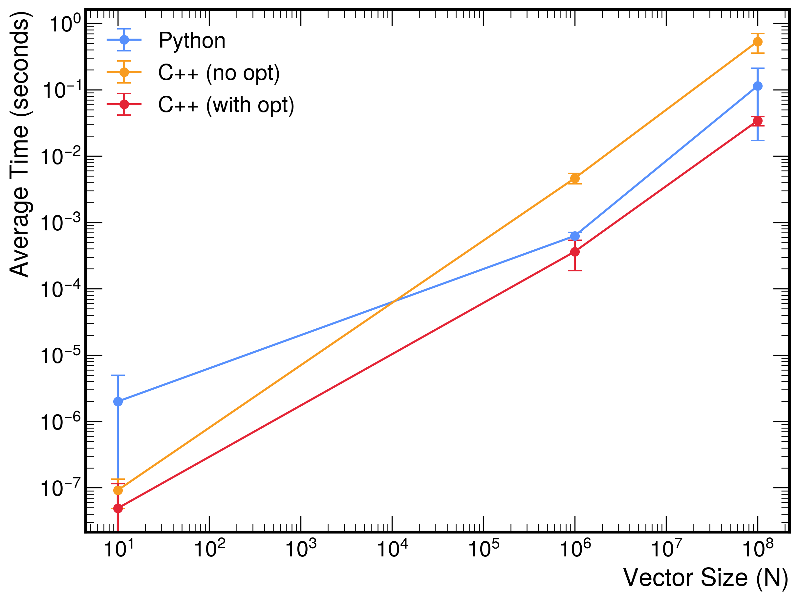

# Vector Sum

This page demonstrates the vector sum operation in both Python and C++. The function computes the vector sum

$$
d = a \cdot x + y,
$$

where \(x\) and \(y\) are vectors of dimension \(N\). The test suites measure the execution time and verify that every element equals the expected result.

---

## Python implementation

```python linenums="1" title="vector_sum_python.py"
import numpy as np

def vector_sum(a: float, x: np.ndarray, y: np.ndarray) -> np.ndarray:
    """
    Compute the vector sum d = a * x + y, where x and y are vectors.

    Parameters:
        a (float): Scalar multiplier.
        x (np.ndarray): A vector.
        y (np.ndarray): A vector.

    Returns:
        np.ndarray: The resulting vector d.

    Raises:
        ValueError: If x and y do not have the same shape.
    """
    if x.shape != y.shape:
        raise ValueError("Vectors x and y must have the same shape.")
    return a * x + y
```

```python linenums="1" title="test_vector_sum_python.py"
import time
import math
import numpy as np
from vector_sum_python import vector_sum

def run_vector_sum_test(n: int, n_iter: int = 1):
    """
    Run the vector sum computation for vectors of size n, measure the execution time
    over n_iter iterations, and verify that each element equals the expected value
    within a defined tolerance.

    Parameters:
        n (int): The size of the vectors.
        n_iter (int): The number of iterations for timing measurement (default 1).

    Raises:
        AssertionError: If any element of the computed vector does not match the expected value.
    """
    a = 3
    x_val = 0.1
    y_val = 7.1
    expected_value = 7.4
    tolerance = 1e-9

    # Create the input vectors of size n.
    x_vec = np.full(n, x_val)
    y_vec = np.full(n, y_val)
    
    times = []
    
    for i in range(n_iter):
        start_time = time.perf_counter()
        d = vector_sum(a, x_vec, y_vec)
        elapsed_time = time.perf_counter() - start_time
        times.append(elapsed_time)
        
        # Verify that all elements equal the expected value within the tolerance.
        if not np.allclose(d, expected_value, atol=tolerance):
            raise AssertionError(f"Test failed for N = {n} on iteration {i+1}")
    
    # Compute average, RMS, min, and max.
    avg_time = sum(times) / n_iter
    rms_time = math.sqrt(sum((t - avg_time) ** 2 for t in times) / n_iter)
    min_time = min(times)
    max_time = max(times)
    
    print(f"Test passed for N = {n} over {n_iter} iterations:")
    print(f"  Average time: {avg_time:.6f} seconds")
    print(f"  RMS: {rms_time:.6f} seconds")
    print(f"  Min time: {min_time:.6f} seconds")
    print(f"  Max time: {max_time:.6f} seconds")

def main():
    run_vector_sum_test(10, n_iter=100)
    run_vector_sum_test(10**6, n_iter=100)
    run_vector_sum_test(10**8, n_iter=10)

if __name__ == '__main__':
    main()
```

### Run the Python tests

Within the container, execute

```bash
python test_vector_sum_python.py
```

### Results

```
Test passed for N = 10 over 100 iterations:
  Average time: 0.000002 seconds
  RMS: 0.000003 seconds
  Min time: 0.000002 seconds
  Max time: 0.000033 seconds
Test passed for N = 1000000 over 100 iterations:
  Average time: 0.000627 seconds
  RMS: 0.000085 seconds
  Min time: 0.000538 seconds
  Max time: 0.001189 seconds
Test passed for N = 100000000 over 10 iterations:
  Average time: 0.114004 seconds
  RMS: 0.096845 seconds
  Min time: 0.070962 seconds
  Max time: 0.392504 seconds
```

## C++ implementation

```cpp linenums="1" title="vector_sum_cpp.cpp"
#ifndef VECTOR_SUM_CPP_HPP
#define VECTOR_SUM_CPP_HPP

#include <vector>
#include <stdexcept>
#include <cstddef>

/**
 * @brief Compute the vector sum d = a * x + y.
 *
 * This function accepts a scalar and two input vectors, and writes the result into
 * the output vector d. It checks that the two input vectors have the same size;
 * if not, it throws an exception. The output vector d is resized to match the input vectors.
 *
 * @param a   Scalar multiplier.
 * @param x   Vector x.
 * @param y   Vector y.
 * @param d   Output vector to store the result.
 * @throws std::invalid_argument if the sizes of x and y are not equal.
 */
inline void vector_sum(double a, const std::vector<double>& x, const std::vector<double>& y, std::vector<double>& d) {
    if (x.size() != y.size()) {
        throw std::invalid_argument("Vectors x and y must have the same size.");
    }
    d.resize(x.size());
    for (std::size_t i = 0; i < x.size(); ++i) {
        d[i] = a * x[i] + y[i];
    }
}

#endif // VECTOR_SUM_CPP_HPP
```

```cpp linenums="1" title="test_vector_sum_cpp.cpp"
#include "vector_sum_cpp.hpp"
#include <iostream>
#include <chrono>
#include <vector>
#include <cassert>
#include <cmath>
#include <numeric>  // For std::accumulate
#include <algorithm>  // For std::min_element and std::max_element

/**
 * @brief Runs the vector sum computation test.
 *
 * This function creates two vectors of size n (with constant values),
 * measures the execution time of the vector sum computation over n_iter iterations,
 * and checks that each element of the resulting vector equals the expected value within a small tolerance.
 *
 * @param n The size of the vectors.
 * @param n_iter The number of iterations for timing measurement (default is 1).
 */
void run_vector_sum_test(std::size_t n, int n_iter = 1) {
    const double a = 3;
    const double x_val = 0.1;
    const double y_val = 7.1;
    const double expected_value = 7.4;
    const double tolerance = 1e-9;

    // Create the input vectors.
    std::vector<double> x_vec(n, x_val);
    std::vector<double> y_vec(n, y_val);
    // Pre-allocate the output vector to be reused.
    std::vector<double> d;
    
    std::vector<double> times;
    times.reserve(n_iter);

    for (int iter = 0; iter < n_iter; ++iter) {
        auto start = std::chrono::high_resolution_clock::now();
        vector_sum(a, x_vec, y_vec, d);
        auto end = std::chrono::high_resolution_clock::now();
        std::chrono::duration<double> elapsed = end - start;
        times.push_back(elapsed.count());

        // Verify that all elements match the expected value.
        for (std::size_t i = 0; i < d.size(); ++i) {
            assert(std::fabs(d[i] - expected_value) < tolerance && "Element does not match expected value.");
        }
    }

    // Compute average time.
    double sum = std::accumulate(times.begin(), times.end(), 0.0);
    double avg_time = sum / n_iter;

    // Compute RMS.
    double sq_sum = 0.0;
    for (double t : times) {
        sq_sum += (t - avg_time) * (t - avg_time);
    }
    double rms_time = std::sqrt(sq_sum / n_iter);

    // Find minimum and maximum times.
    double min_time = *std::min_element(times.begin(), times.end());
    double max_time = *std::max_element(times.begin(), times.end());

    std::cout << "Test passed for n = " << n << " over " << n_iter << " iterations:" << std::endl;
    std::cout << "  Average time: " << avg_time << " seconds" << std::endl;
    std::cout << "  RMS: " << rms_time << " seconds" << std::endl;
    std::cout << "  Min time: " << min_time << " seconds" << std::endl;
    std::cout << "  Max time: " << max_time << " seconds" << std::endl;
}

int main() {
    // Run tests for three different vector sizes with 5 iterations each.
    run_vector_sum_test(10, 100);
    run_vector_sum_test(1000000, 100);   // 10^6
    run_vector_sum_test(100000000, 10); // 10^8
    return 0;
}
```

### Compile and run the C++ tests

=== "Without optimization flags"

    1. Compile the C++ code:

        ```bash
        g++ -O0 -std=c++11 test_vector_sum_cpp.cpp -o test_vector_sum_cpp
        ```

    2. Run the executable:

        ```bash
        ./test_vector_sum_cpp
        ```

=== "With optimization flags"

    1. Compile the C++ code:

        ```bash
        g++ -O3 -std=c++11 test_vector_sum_cpp.cpp -o test_vector_sum_cpp
        ```
    
    2. Run the executable:

        ```bash
        ./test_vector_sum_cpp
        ```


### Results

=== "Without optimization flags"

    ```
    Test passed for n = 10 over 100 iterations:
      Average time: 9.207e-08 seconds
      RMS: 4.34307e-08 seconds
      Min time: 8.3e-08 seconds
      Max time: 5e-07 seconds
    Test passed for n = 1000000 over 100 iterations:
      Average time: 0.00464462 seconds
      RMS: 0.000816384 seconds
      Min time: 0.00445675 seconds
      Max time: 0.0124259 seconds
    Test passed for n = 100000000 over 10 iterations:
      Average time: 0.533384 seconds
      RMS: 0.177033 seconds
      Min time: 0.47326 seconds
      Max time: 1.06448 seconds
    ```

=== "With optimization flags"

    ```
    Test passed for n = 10 over 100 iterations:
      Average time: 4.919e-08 seconds
      RMS: 6.65792e-08 seconds
      Min time: 4.1e-08 seconds
      Max time: 7.09e-07 seconds
    Test passed for n = 1000000 over 100 iterations:
      Average time: 0.000363343 seconds
      RMS: 0.000176492 seconds
      Min time: 0.0002985 seconds
      Max time: 0.00170587 seconds
    Test passed for n = 100000000 over 10 iterations:
      Average time: 0.0341018 seconds
      RMS: 0.00540988 seconds
      Min time: 0.0321475 seconds
      Max time: 0.0503235 seconds
    ```


## Discussion

