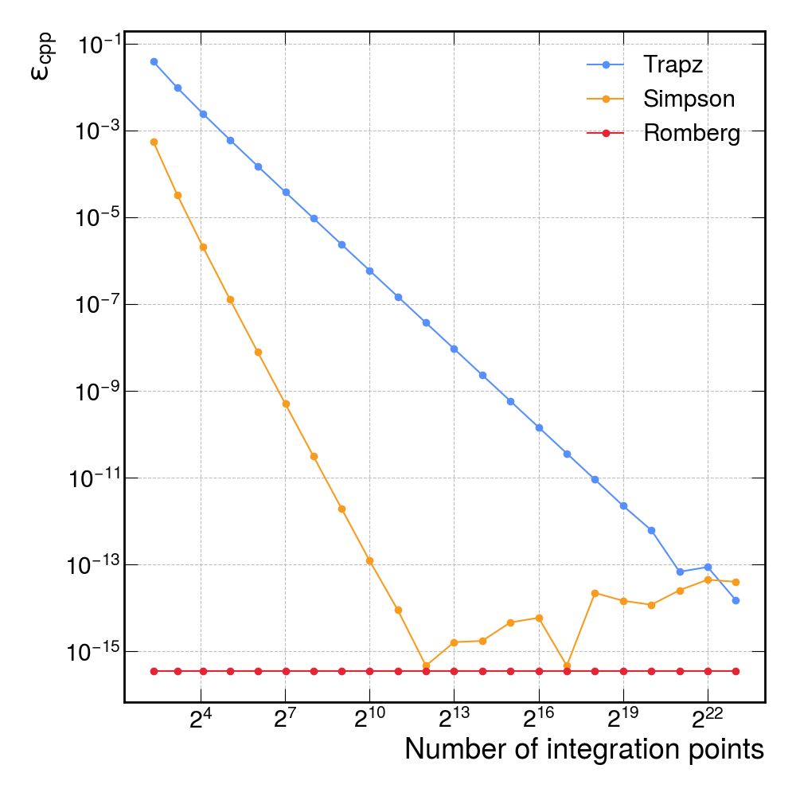
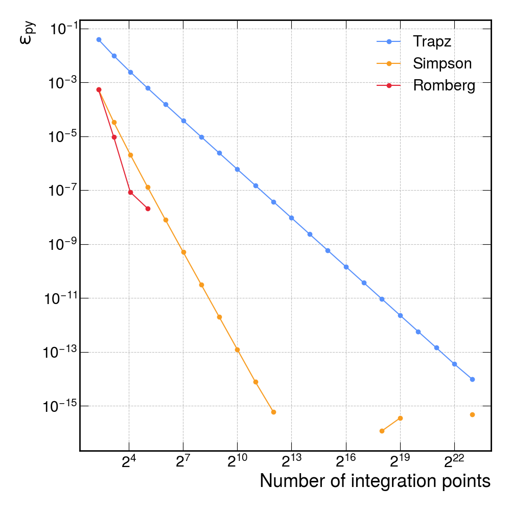
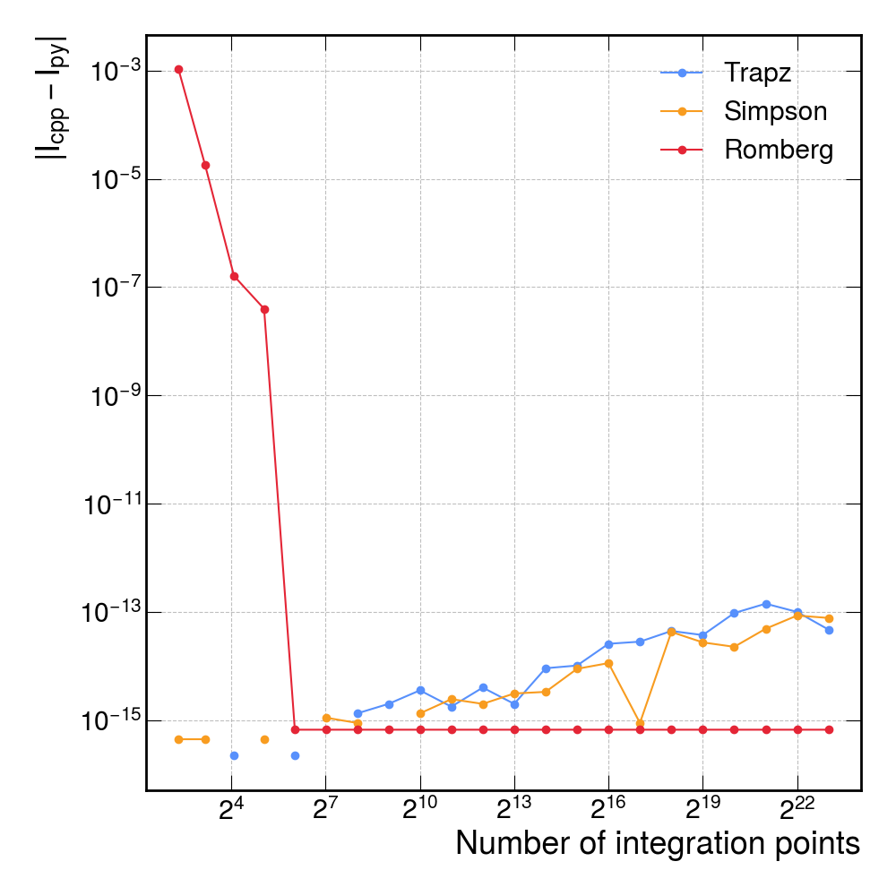

# Results and discussion

This page presents and interprets the comparison plots for the three integration methods: Trapezoidal rule, Simpson’s rule, and Romberg integration. Figures show:

1. Absolute differences between C++ and Python results.
2. Relative errors in the C++ implementation versus analytic solution.
3. Relative errors in the Python implementation versus analytic solution.

All plots use a log–log scale and vary the number of sampling points $N$ from $2^3$ to $2^{23}$.

## Relative errors: C++ vs Analytic Solution

The trapezoidal rule decays as $O(h^2)$, where $h$ is the step size. In the log-log plot, this appears as a straight line with slope $-2$. 

Simpson’s rule decays as $O(h^4)$, appearing as a straight line with slope $-4$ until it reaches machine precision around $N \approx 2^{12}$.

Romberg integration instead achieves machine precision for essentially all $N$ values, showing rapid convergence to the analytic solution.

## Relative errors: Python vs Analytic Solution

The Python implementations mirror the C++ convergence rates. Slightly larger absolute errors at small $N$ for Romberg's Python implementation reflect differences in floating‑point routines and array handling in NumPy.

## Absolute differences: C++ vs Python

Romberg differences plateau at around $10^{-15}$, indicating both implementations reach machine precision and agree within rounding error. Simpson and Trapz differences reach $10^{-13}$ for large $N$. Small deviations are due to differences in loop ordering and floating‑point summation between C++ and NumPy.

The two languages produce numerically consistent results at the level of machine precision.

